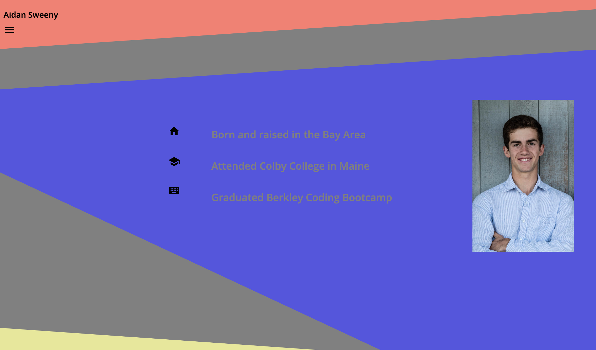
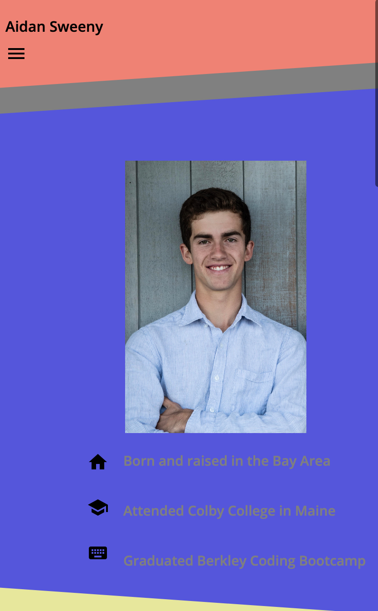
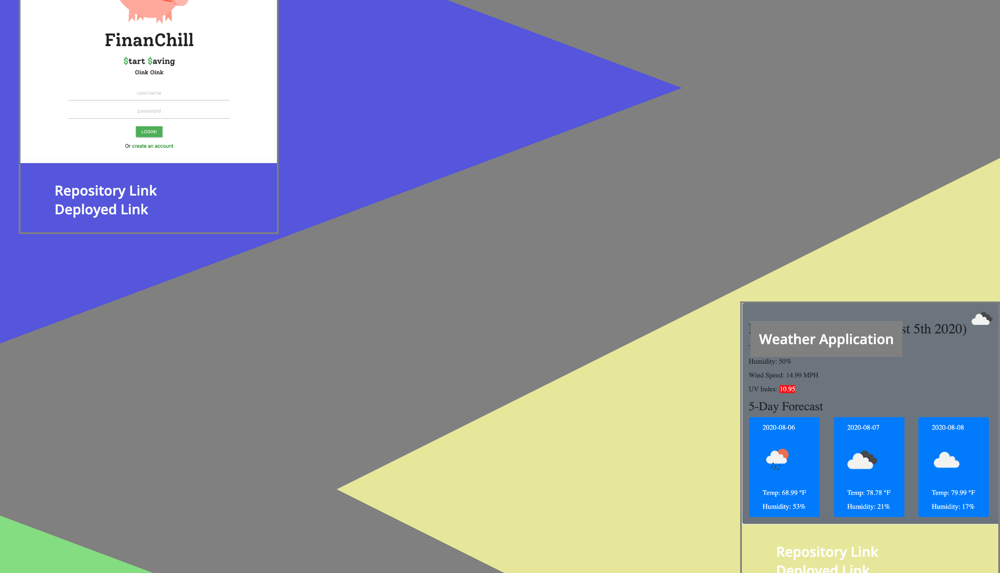
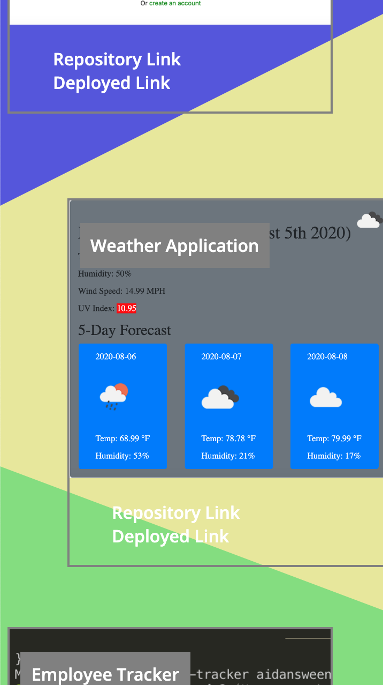

# new-portfolio
For this Project I created a new portfolio for all of my work. I wanted to do some different styling for the project, so I opted to not use any CSS libraries. I started by creating the nav bar, which uses css animations to transition smoothly between two states. Using different sized borders for objects that did not exist I was able to manipulate divs into triangles. I used this as the theme for this profile. I was very happy with how I was able to get the breakpoints to manipulate the page. I was able to have it flow from the large scale to mobil responsive:

Home page: 



Project page: 



I used sequelize so that I could obtain data from a SQL table that contained my education, skills, and projects. I used client side calls in order to populate my html files, and then api calls server side for the get requests. I also used two different html calls for the two differnet pages. After populating the page, I styled everything in a fashion that I thought was appropriate.

## Getting Started

To get this project running, one must copy the files from the class repository.

### Prerequisites

To have this project run, one must download VS Code off the appstore, and create a GitHub account. Git is also required to run this program, which can be downloaded 

```
$ brew install git. 
```
Homebrew can also be downloaded by inputting the following command in the terminal:
```
/bin/bash -c "$(curl -fsSL https://raw.githubusercontent.com/Homebrew/install/master/install.sh)"
```

### Installing

To install this project one must go through the GitHub website in order to clone this project. Clicking on the cone or download button and then copying the link that comes from that. One can then go into the Terminal application, and use the following command to copy the files:
`
git clone URL
`
This should then be moved to your desktop, or somewhere else on your computer. This will allow access to the html and css files. After running npm install in the terminal, the user can run the project with node server in the terminal.

## Built With

* [HTML](https://developer.mozilla.org/en-US/docs/Web/HTML)
* [CSS](https://developer.mozilla.org/en-US/docs/Web/CSS)
* [Javascript](https://developer.mozilla.org/en-US/docs/Web/JavaScript)
* [Heroku](https://devcenter.heroku.com/categories/reference)
* [SQL](https://dev.mysql.com/doc/)
* [Express.js](https://expressjs.com/)

## Deployed Link

* [See Live Site](https://damp-brook-93467.herokuapp.com/projects)

## Authors

* Aidan Sweeny

- [Link to Github](https://github.com/AidanSweeny)
- [Link to LinkedIn](https://www.linkedin.com/in/aidan-sweeny-81075030/)

## License

This project is licensed under the MIT License 

## Acknowledgments

* Berkley Coding Bootcamp


